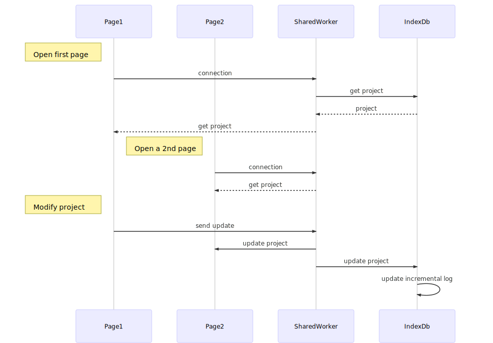

# Data store manager

The component to store and handle data is composed of 3 sub-components.

* The [store component][Store component] which is the entry of the component in each pages.
* The Data are stored in the [indexDb][IndexDb] component.
* The [store manager][Store manager] handles the communication between store components and indexDb. It propagates informations through all pages.

Watch [workflow][Workflow] to know the communication process and what is the [protocol][Protocol] when a data is changed.

[Store manager]:#Store-manager(How data are managed in the application)

## Store manager

This is the main component.
It is built inside a shared-worker. This way it allows to open several pages of the same project.

It keeps a version of project in raw object format.
Any changes to this project are propagated to all store-managers connected and to indexDb.

[IndexDb]:#IndexDb(How data are stored in a local database)

## IndexDb

This is the place where the data are stored.
It use indexDb to keep changes in user browser.
It is located inside the shared-worker in order to be manipulated by Store manager.

There are 3 tables:

* project: It stores projects. There are one named DRAFT which is the current project of user until he saves it.
* log: There are all changes done to project in order to revert back these changes.
* environements: it stores all configurations about user preferences.

[Store component]:#Store-component(How data are retrieved from application)

## Store component

This is the entry component from pages. It is located in the main thread.
It handles communication with Store manager and convert changes to Backbone events.

[Workflow]:#store-workflow(How data are stored and manipulated)

# Workflow

[Protocol]:#protocol(How communication work to know changes)

# Protocol about data changes in projects

In order to communicate efficiently which change is done a string describing the path of the chain is defined.

The main syntax is

 `path = value`

* value in JS format (string are surrounded by ""), objects are written in JSON format.
* path indicates the attributes and sub-attributes in the project. Attributes are separeted by dot (.) and to identify an element in a collection square brackets are used ([]). Inside square brackets, if it is a number it indicates the index inside the collection; otherwise it must be written in the form `attribute=value`.
	* attribute is the name of an attribute of elements (mainly an id).
	* value is the value of this attribute to retrieve the right element.

[Structure]:#structure(How objects are stored in database)

# Structure

[Structure-context]:#structure-context(How objects are stored in database)

## Context

It stores environment context in order to restore the same state in next session.

* key: the name of the attribute
* value: the current value for this attribute

### key

* logId: the current position in logs
* lng: the current language selected by user
